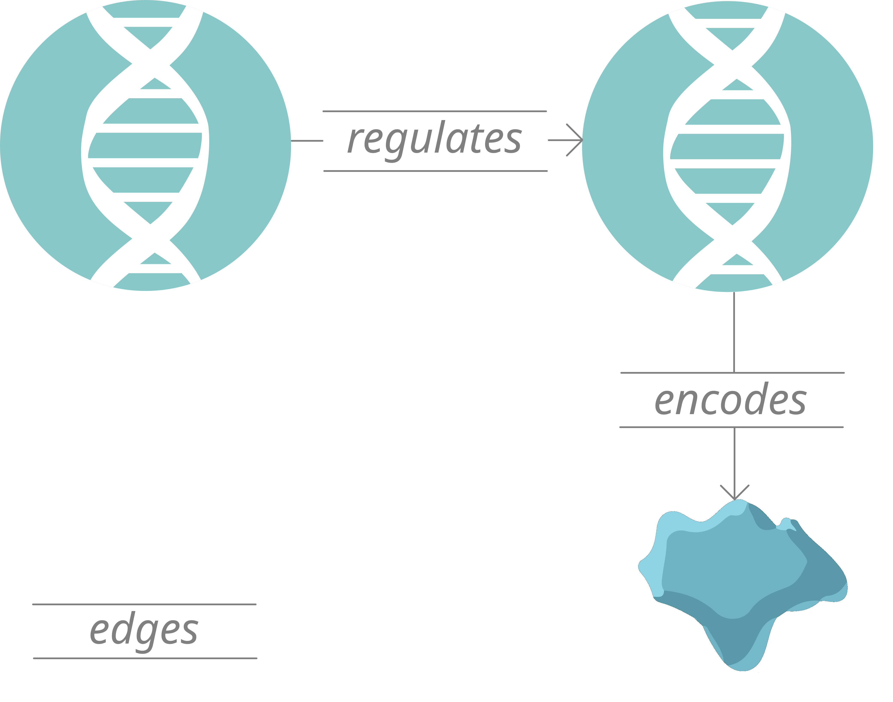
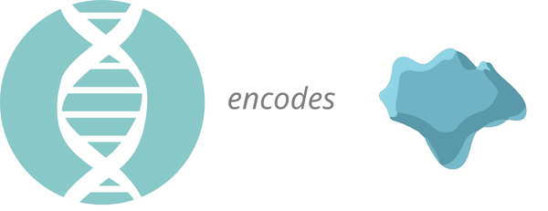
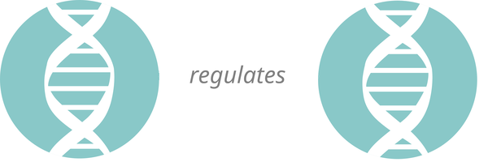
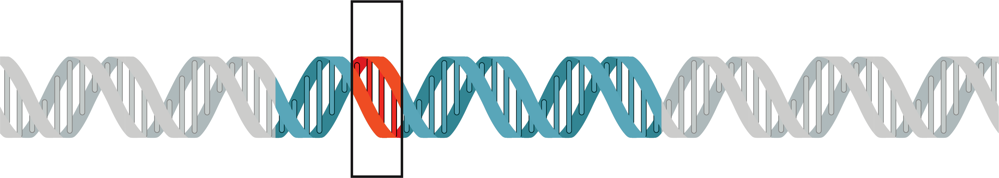
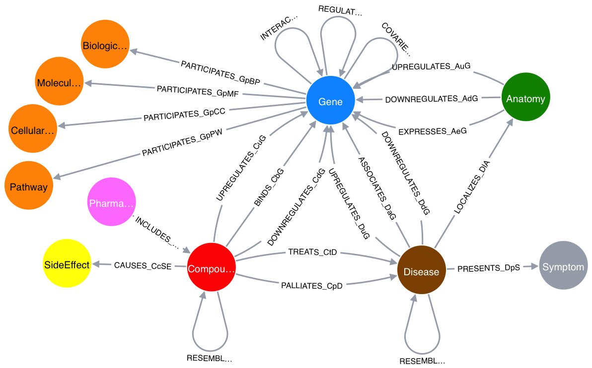
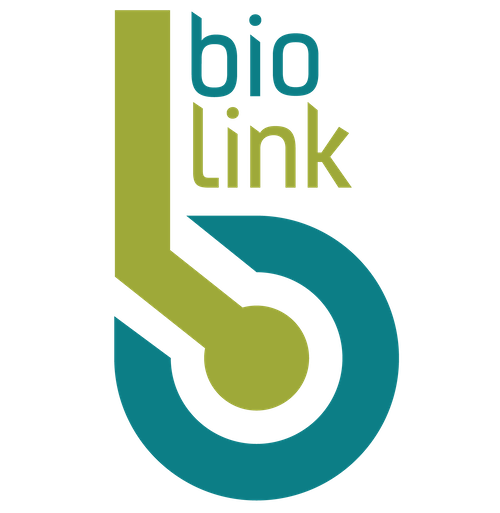
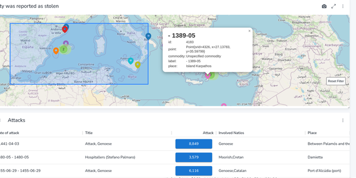

<!-- ask Magdalena: Asparagine → Glycine is the actual amino-acid substitution or not? -->

# Knowledge Graphs & Ontologies in Biology

---

# Why we use Knowledge Graphs

- Biology is extremely relational: **encoding, interaction, affecting, targeting.**
- A `encodes` B
- Understanding the full semantic connections between different entities, such as specific proteins, genes, and codons, is difficult without automation.

--- 

# Nodes vs Edges

* Nodes are the biological semantic entities in the graph, such as proteins, genes, transcription factors, pathways, diseases, or compounds.
* Edges are the typed **relationships** between nodes, such as `interacts_with`, `regulates`, `expressed_in`, `targets`, or `associated_with`.
<!-- (discuss uncertainly/clear statemnets, entails, containers, has, can) -->
* Usually, we break down every kind of information in a knowledge graph into Triplets:

Subject `relationship` Object
Drug `treats` Disease B

* **You can define this for your own dataset with BioCypher!**

---

# Nodes vs Edges - COLLECTRI data Example

* In a regulatory interaction dataset such as COLLECTRI, transcription factors and genes can be represented as nodes, while experimentally supported regulatory relationships can be represented as edges.
* Both kinds of data are important: nodes tell us *what* exists, and edges tell us *how entities relate biologically*.
* Any node can have any number of edge relationships. or regulatory relationships in this example

---
<!-- _class: node-edge-examples -->
# Node and Edge examples

  <figure data-marpit-fragment="1">
    
    <figcaption>a gene encoding a protein</figcaption>
  </figure>
  <figure data-marpit-fragment="2">
    
    <figcaption>a gene regulating another gene</figcaption>
  </figure>

---

# How we interact with a knowledge graph

* We can "query out" from the root node along a path, looking at its relationships
* We "MATCH"(return results) - for relationships we are interested in, e.g. `encodes` but not others e.g. `affects` **and the other node(s)**
* This naturally fits how we model causal relationships conceptually - as causal inference across a path of entities
* Or thinking of conditions as sub classes, like **Immune System Disease** being a `subclass of` **Disease**

<!-- first connection level in the path is "0", that's why you see [0..*] notation 
any number of combinations is possible -->

---

# How this helps us to research

* We can **query** this knowledge to go from a protein to the gene which encodes it, and generate a list of the different genes which regulate that gene.
* This allows us to use the existing scientific body of relationships to identify interesting candidate genes for further investigation.

* Large BioCypher projects combine massive bodies of scientific knowledge
* ... which can be queried without thousand-line procedures of queries you need in other solutions (*NoSQL/RDBMS*)

---

# Reasoning

* "Extrapolating" further information from the information at hand:

* Drug A `treats` Disease B
* Disease B is a `subclass of` Immune System Disease
* = Drug A `treats` **some** Immune System Disease(s)

Different algorithm options exist to manage how these reasoning inferences can be drawn

---
# Biocypher allows you to reinterpret old information for new insgihts

* 1. Imagine you have 3 different datasets from different experiments focusing on different genes.
* 2. You can use BioCypher to import data from each experiment, and provide data fitting connecting your knowledge graph, to establish how these genes are connected (or use an existing public dataset containing that ifnormation)
* 3. You can make new graph queries with the proteins between these 3 datasets to use in a 4th paper.

* If the same entity appears in multiple datasets, you can choose the strategy for connecting it to the graph.

---

# What is an ontology?

* An ontology is a controlled vocabulary for a domain, such as `subclass of` and raw data types metrics/units.
* It defines what kinds of things exist, what they mean, and how they can relate to each other.
* In biology, this matters because the same thing can be named, grouped, or interpreted differently across datasets.
* In computational work, an ontology is a formal, explicit specification of a shared conceptualisation.

Guarino, N., Oberle, D., & Staab, S. (2009). What is an ontology? In Handbook on ontologies (pp. 1–17). Springer.

---

# Ontology example: precise medical terminology

* In medicine, precise terminology is not just style, it changes meaning.
* “Seizure”, “convulsion”, and “abnormal motor movement” can overlap in everyday speech, but they are not the same thing in structured clinical data.
* An ontology helps decide what concept is being described and how it relates to symptoms, diagnoses, observations, and patient features.
* Not actual data - relationships 

---
# Ontology example

Daniel Himmelstein, Dec 19, 2016

---

# Schemas
* We need to define the specific node and edge relationships in our data
* A schema file allows us to describe possible **triplets** in a consistent way.
* Whereas an ontology can cover many relationships, the Schema only covers relationships we have or expect data for in our study

---

# Schemas role in the project: Defining the information frame of your research question
* We often customize the schema to bespokely recognise the information architecture/value intrinsically in our data (which may differ from another information frame)
* ... to match our research question
* What is in one schema, should usually be interally consistent in terms of batch effects
---

# Why schema files are useful to you

* They make the graph structure understandable in a concise, standardised way.
* They clarify valid nodes and edges.
* They prevent every adapter from inventing slightly different labels for the same things.
* They give you a guide as to what you will use to query Neo4j with later

<!-- they prvoide a concise definition of the biological concepts and links between them in the dataset. The graph sturcture is usually tailored to your research question too -->
---

# BioCypher schema example

<pre><code class="language-yaml">gene:
  represented_as: node
  preferred_id: hgnc.symbol
  input_label: gene
  properties:
    name: str

...
</code></pre>

---

# BioCypher schema example

<pre><code class="language-yaml">gene:
  represented_as: node
  preferred_id: hgnc.symbol
  input_label: gene
  properties:
    name: str

transcription factor:
  is_a: gene
  represented_as: node
  preferred_id: hgnc.symbol
  input_label: transcription factor
  properties:
    name: str
    category: str

...
</code></pre>

---

# BioCypher schema example

<pre style="font-size: 0.82rem; line-height: 1.4; padding: 1rem; overflow-x: auto; white-space: pre; background: #f6f8fa; border: 1px solid #d0d7de; border-radius: 6px;"><code class="language-yaml" style="font-family: ui-monospace, SFMono-Regular, Menlo, Monaco, Consolas, monospace;">gene:
  represented_as: node
  preferred_id: hgnc.symbol
  input_label: gene
  properties:
    name: str

transcription factor:
  is_a: gene
  represented_as: node
  preferred_id: hgnc.symbol
  input_label: transcription factor
  properties:
    name: str
    category: str

transcriptional regulation:
  is_a: pairwise gene to gene interaction
  represented_as: edge
  source: transcription factor
  target: gene
  input_label: transcriptional regulation
  properties: ...
</code></pre>

---

# Ontology vs schema

* **Ontology:** agreed language for entities and interactions
* **Schema:** the project-specific guidebook for how this dataset becomes a graph for our data
* When using external frameworks like BioLink, Ontology gives the shared biological meaning.
* Reusing BioLink types makes your data consistent with BioLink*, for queries that use extended data, as you implement your Schema.

Guarino, N., Oberle, D., & Staab, S. (2009). What is an ontology? In Handbook on ontologies (pp. 1–17). Springer.

* Catch: Batch effects

---
# Example

<!-- hopefully somebody finds something to dislike, and then we can say: the point is a difference frame of viewing - agreeing ahead of time -->
<!-- experimental whether to say that, need to check on Sunday; I don't want to frame that Biolink relationships are irrelevant from some views which clashes with the point above -->
<!-- the fact participants will have slightly different models of how object entities/definitions and relationships are defined will not be that revealed -->
<!-- they may confuse that this example of a general ontology shows something you may change, with it being a Biolink "gold example" -->

---

# Biolink as shared biomedical language
<ul>
<li data-marpit-fragment="1" style="list-style: none;"></li>
<li data-marpit-fragment="2">Biolink provides a shared upper level schema  for biomedical entities and relationships.</li>
<li data-marpit-fragment="3">As a researcher you can extend these entities or relationships for your research question.</li>
<li data-marpit-fragment="4">That common grammar makes integration with other data sources more easy, and makes running the same query on two different sets of data easier.</li>
</ul>

Unni, D. R., Moxon, S. A., Bada, M., Brush, M., Bruskiewich, R., Caufield, J. H., et al. (2022). Biolink Model: A universal schema for knowledge graphs in clinical, biomedical, and translational science. Clinical and Translational Science, 15(8), 1848–1855.

---

# How you actually use Biolink in BioCypher
* We set our "Head Ontology" in Biocypher to Biolink

* We map our data - imagine CSV columns - into Biolink types
* Then we add the edge relationships - defined by Biolink - we know exist across our entities.
* Our data is now fully parse-able by a Biolink ontology-based query!

---

# Keeping projects clear and maintainable - why BioCypher helps you start off right

* Using Biolink as our Head Ontology, we can start our project **cleanly** with a **clear, yet extensible** set of valid nodes and edges

* Combined with `strict mode` - which requires license, source - we can ensure all data that ever enters our graph follows data provenance

* These two acts of discipline prevent maintenance work later and gives you confidence in your projects set up *without requiring major incremental effort*

* Projects with strict data provenance and clear Ontology's to map to are **projects other scientists want to use**

---

# Querying knowledge graphs with Neo4J

* Neo4j allows you to write queries, which can each `match` based upon multiple relationships and nodes.
* This asks which transcription factors activate which genes, and what references support the relationship.

<pre data-marpit-fragment="3"><code style="font-size:0.85em" class="language-cypher">MATCH (tf:`transcription factor`)-[r:`transcriptional regulation`]->(g:gene)
WHERE r.activation_or_inhibition = "activation"
RETURN tf.name, g.name, r.references
LIMIT 10
</code></pre>

These feel logical, do not require long procedures to combine separate queries

---

<!-- ask Magdalena: Asparagine → Glycine is the actual amino-acid substitution or not? -->
<!--
# We all use relationships to inform research inquiry - Medical study example

IVF is extremely difficult and can be unpredictable for women to undertake, as each treatment round is uncertain. Additionally, treatment response rates are not uniform for IVF.

* We understand some genetic elements behind IVF response.
* We understand a lesser proportion behind POI, Primary Ovarian Insufficiency.
* For IVF patients, we measure follicle response during treatment.
-->
---
<!--
# Medical study example part two

* FSH is follicle-stimulating hormone.
* FSH stimulates follicle development through FSHR.
* FSHR variation has been associated with different ovarian response to stimulation in IVF/ICSI patients.
* The specific FSHR variants often discussed are amino-acid-changing polymorphisms, including Thr307Ala and Asn680Ser.
* Those receptor and pathway differences may affect biological functions such as ovarian follicle development and treatment response.
* The point is the chain of events: hormone signal, receptor response, pathway activity, follicle response.

Loutradis, D., Patsoula, E., Minas, V., Koussidis, G. A., Antsaklis, A., Michalas, S., & Makrigiannakis, A. (2006). FSH receptor gene polymorphisms have a role for different ovarian response to stimulation in patients entering IVF/ICSI-ET programs. Journal of Assisted Reproduction and Genetics, 23(4), 177–184.

-->
---
<!--
# Theoretical study

**Theoretical study: Can we use known FSH and pathway relationships to explore overlap between POI biology and IVF follicle response?**

* This is a graph-based research question.
* It does not mean POI and IVF response are the same.
* It means we can query shared hormones, receptors, genes, pathways, and phenotypes.
* We can use the graph to find candidates for further investigation.
-->
---
<!--
# The power of that is querying across a massive range of interconnected entities:

* The fact that POI, Primary Ovarian Insufficiency, is conceptually linked to IVF enables us to explore this research direction, and in this case can be identified as a research question manually.
* But in some cases, we have many different partially related concepts: different amino acids, thousands of genes, and different ways of categorising disease.
* Knowledge graphs can help us identify and filter the *most promising candidates* at scales of relationship traversal we could never achieve ourselves by hand.
-->
---

# Why Knowledge Graphs are useful to you

* If you believe the processes, pathways, and subtypes in your data provide **semantic context** to research, you can connect your data to other datasets.
* That makes it easier to manage data duplication, and the biological context around relationships.
* Third-party knowledge graphs can provide prior biological context, but they do not become extra experimental samples by default.
* Knowledge graphs work with relationships in any direction.

---

# Computational value of explicit assertions

* Explicit assertions can be queried in Neo4j.
* They can be filtered, validated against schema constraints and embedded as features for statistical and machine learning models(e.g. historical cases).
* Formal schemas and constraints can be processed computationally.

---

# Citations and provenance are key for relaible research

* For data provenance (for example from the start, using BioCypher strict mode), standardization and graph libraries support citing data information
* In Biology, your data's source and batch is critical for batch effects and comparability
* A relationship or entire dataset can have a source, method, dataset, paper, and confidence.

McMillen, P., Novak, R., & Levin, M. (2020). Toward decoding bioelectric events in Xenopus embryogenesis: New methodology for tracking interplay between calcium and resting potentials in vivo. Journal of Molecular Biology, 432(2), 605–620.

---

# Knowledge Graphs

* A knowledge graph becomes useful because entities are not treated as isolated rows; they are connected through typed, interpretable relationships.
* Queries can follow biologically meaningful paths across genes, proteins, pathways, phenotypes, treatments, and diseases.
* Knowledge graphs are useful when data for a specific subtype is sparse because they can point to related conditions, phenotypes, mechanisms, or prior evidence.
* This supports hypothesis generation and comparator discovery, but it does not increase the experimental sample size by itself.

---

<!-- ML related, so removed: 
# Example 1: Query the Knowledge Base for candidates to investigate:

* Which ion channels or gap-junction proteins are connected to certain phenotypes,
* are expressed in the relevant tissue,
* and are targetable by known compounds?

= a list of gap-junction proteins to investigate further for research applicability.

---

# Moving from sparse data to relevant evidence

* BioCypher can help structure heterogeneous biomedical data as a knowledge graph.
* This makes it easier to connect a rare subtype to related conditions, pathways, phenotypes, or historical evidence.
* This does not increase your experimental sample size by itself.
* External datasets are not automatically additional samples.
* Provenance, batch effects, population differences, and measurement differences still matter.
* These graph connections can support **cohort discovery**, **comparator group selection**, and **feature engineering**.
* Whereas LLMs are stochastic and unpredictable, graph queries are predictable and rules-based.

Lobentanzer, S., Aloy, P., Baumbach, J., Bohar, B., Carey, V. J., Charoentong, P., et al. (2023). Democratizing knowledge representation with BioCypher. Nature Biotechnology, 41(8), 1056–1059.

---

# Using graph-informed evidence for model training

* **For model training**, graph-derived relationships can be used as additional features.
* They should not be treated as extra experimental samples unless a separate statistical integration method justifies that.
* These features can represent genes, pathways, variants, diseases, or prior biological relationships.
* The model still needs empirical validation.

---

# Using graph-informed evidence for prediction

* **For prediction**, when a subtype has few direct cases, the graph can help identify related diagnoses, phenotypes, laboratory findings, or clinical relationships.
* Example feature: `count_of_related_negative_case_patterns`
* This is prior context for the model, not automatic extra sample size.

-->
---

# Knowledge graphs can have spatial data: Mediterranean map

---

# Knowledge Graphs can still be exposed in spatial interfaces:

---

# Challenges with knowledge graphs

* Different ways of describing the same ontologies, or different levels of data granularity for knowledge graph content.

* Sometimes, the same biological “unit” can be described at slightly different, overlapping scales.

* Without schema discipline that BioCypher enforces, large graphs can become difficult to trust, query, and maintain.

---

# The goal of BioCypher is to resolve the difficulty of:

(A) understanding the applicability of knowledge graphs for biological research inquiry in your subdomain
(B) enabling easier to state queries with Knowledge Graphs
(C) harmonizing your own data with an extensible Separation Of Concerns technical approach
(D) sharing your data in a reusable way with the wider scientific community to achieve faster overall progress in biology

---

# BioCypher goal / purpose

* BioCypher does not try to make one universal biology graph;
* It helps you to create a graph for your research question, with access to biological data sources
* It keeps source provenance while mapping data onto biomedical ontology's.

Lobentanzer, S., Aloy, P., Baumbach, J., Bohar, B., Carey, V. J., Charoentong, P., et al. (2023). Democratizing knowledge representation with BioCypher. Nature Biotechnology, 41(8), 1056–1059.

---

# The power of ontology:

* Having relationships defined in an ontology schema means confusion over similar entities, entities that are part of each other, dissimilar but similarly named entities, a recurrent risk in biology, or the same entity with different names, such as “human” vs “Homo sapiens”, can be approached systemically for better **data consistency**.

---

# BioCypher configures stringent regulation, with project-specific schemas

* Rather than having questions later, such as “is seizure a Symptom, Clinical Finding, or PatientFeature in this context?”, you decide **when integrating data**.
* Being able to have an explicit record of what decision was made means you can make sure queries are exhaustive for your data, and slight semantic differences cannot prevent finding everything that actually satisfies the query in your dataset.
* Example: recording seizure as a Clinical Finding, but only looking for “Symptoms” and not finding it.
* We cover most Harmonization levels(Structural, Label, Semantic) on Wednesday

<!-- when integrating data = conceptually when defining the schema -->

---

# But, my data would take a long time to convert into ontology concepts from raw CSVs...

* Entity linking can automatically map text or labels to ontology/database IDs, e.g. “seizure” → HPO: Seizure; “EGFR” → UniProt/HGNC gene/protein ID.

* For tabular data, OntoWeaver can map tables into semantic knowledge graphs in BioCypher.

* For free text, it can be partially automated: scispaCy, MetaMap, CLAMP, MedCAT.

<!-- also removed because we will wait until Edwins Tuesday session to cover adapters
---

# Quick topic: Adapters

* Adapters provide an ontology-aligned way to bring existing biological resources into your graph.
* After using an adapter, Neo4j queries can use extra relationship data matched to entities in your dataset.
* Example: an adapter has information on which ion channels are expressed in different tissues, and which compounds can target them. Your data has some of the ion channels, so your queries can use that linked tissue and compound context.

---

# What the community adapters allow you to do:

* This allows you to ask richer biological questions immediately, without manually rebuilding all known relationships yourself.
* It provides a model of how relationships are often defined in this area of biology.
* It lets your dataset link to useful context from established biological resources, such as tissue expression, protein function, disease links, and compound targeting.

-->
---

# Summary

- Knowledge graphs help us make data with relationships navigable and queryable.
- Defining schemas for your ontology in BioCypher lets us enforce data consistency and establish data provenance. Schemas give you powerful insight into what queries you can make.
- Existing ontologies and your datasets can be harmozied with provenance via strict mode from the start.
- This supports richer queries, candidate discovery without needing to maintain complex, slow procedures
- Now we understand the theory here, we will cover how these actually interact from a CSV to a public dataset.

<!-- maybe don't cover: batch effects and why extended datasets that analyzed the same data you have(e.g. but 10x more) cannot simply contribute to your data samples, even if you use exactly the same Ontology (e.g. BioLink -->
<!-- all icons from https://bioart.niaid.nih.gov/ BIOART -->
