---

# Semantic Knowledge Graphs

---

# Sharing experience from your Projects

* If you have built significant projects: please prepare for after the coffee break

---

# Knowledge Graphs & Ontologies in Biology

---

# What are Knowledge Graphs?

<!-- Example 4-step biological path: EGFR gene encodes epidermal growth factor receptor protein; EGF protein binds epidermal growth factor receptor; receptor activation regulates MAPK signaling; MAPK signaling changes MYC gene expression. -->


---

# Data in biology is messy
* High volume, heterogeneous
* Some - or most - of the most important information is captured in relationships: **encoding, binding, targeting.**
* For example: **The EGFR gene `encodes` the epidermal growth factor receptor protein**.
* As in philosophy, formal logic, and expert systems
* Understanding the full semantic relationships between different entities, such as specific proteins, genes, and codons, is difficult

---

# Defining Graph Data
* We have two minimal tasks:
* Clarifying how types of entities relate as types (e.g. `gene` **encodes** `protein` is a valid relationship between those two "types"), but not `gene` **binds to** `protein`
* Clarifying for each instance of data that we have which of the types we have defined it is (e.g. `EGFR gene` is a `gene`)

* Critically, we can model both in a graph: both definitions and instance data


---
<!-- _class: node-edge-examples -->
# Each entity can have many relationships

<div class="example-grid">
  <figure data-marpit-fragment="1">
    
    <figcaption>a gene (e.g. EGFR) encoding a protein</figcaption>
  </figure>
  <figure data-marpit-fragment="2">
    
    <figcaption>a gene regulating another gene</figcaption>
  </figure>
</div>

---

# Formalizing relationships: Nodes and Edges
* Nodes are the biological semantic entities in the graph
* Proteins, genes, transcription factors, pathways, diseases, or compounds...
* Edges are the typed **relationships** between nodes
* `interacts_with`, `regulates`, `expressed_in`, `targets`, or `associated_with`.
<!-- (discuss uncertainty/clear statements, entails, containers, has, can) -->
* Usually, we break down every kind of information in a knowledge graph into triples:
* Subject `predicate` Object
* Drug `treats` Disease B
* You can define this **for your own dataset with BioCypher!**

---

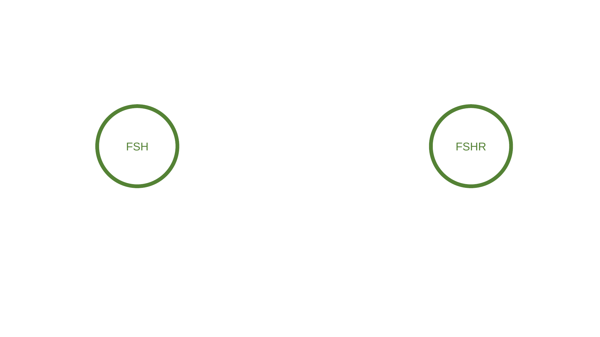

---

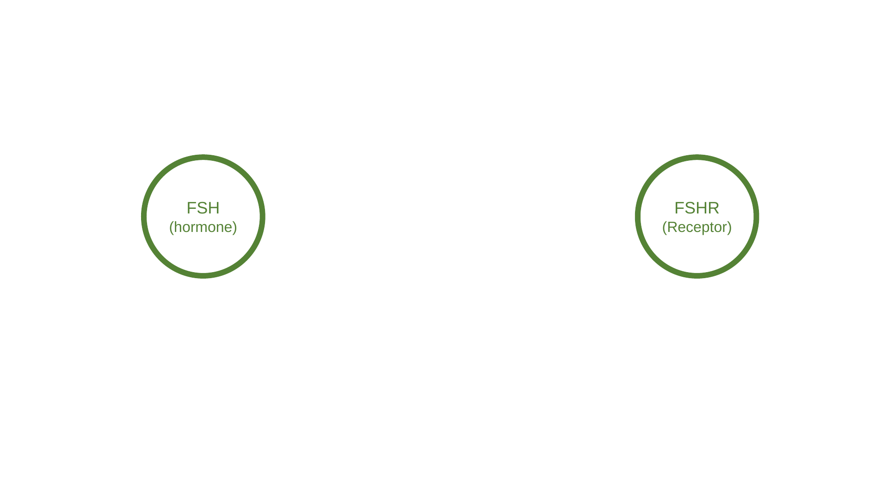

---

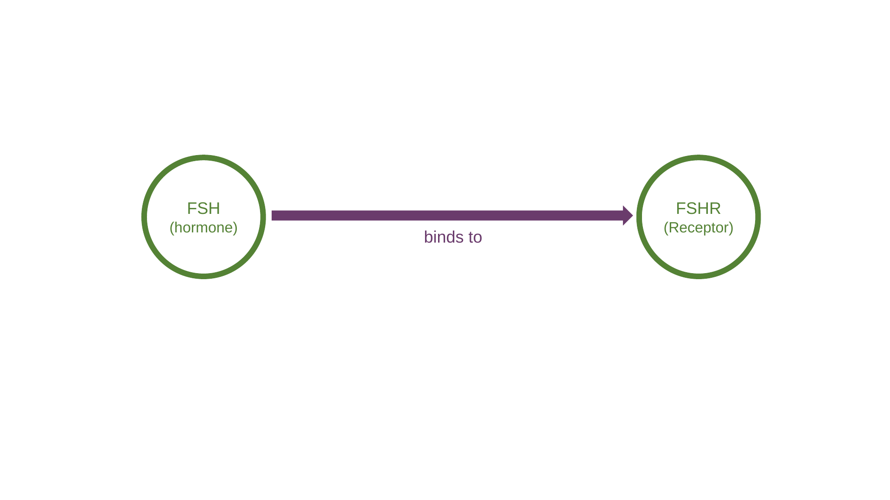

---

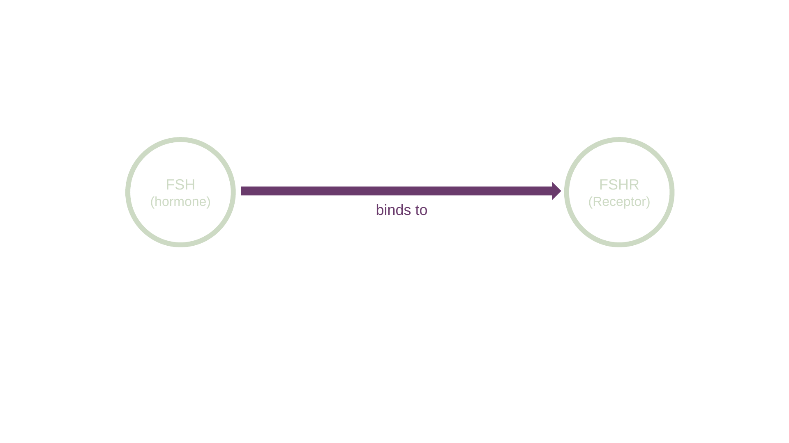

---

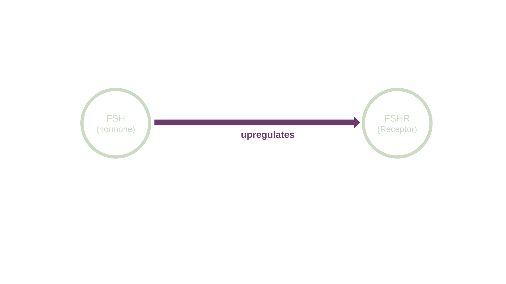

---

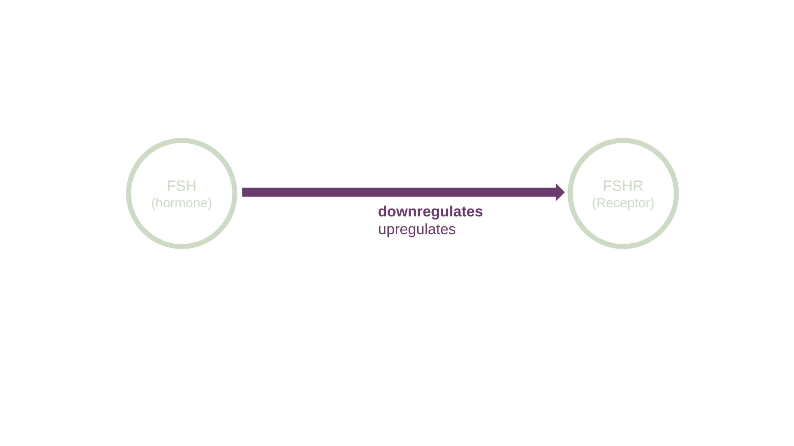

---

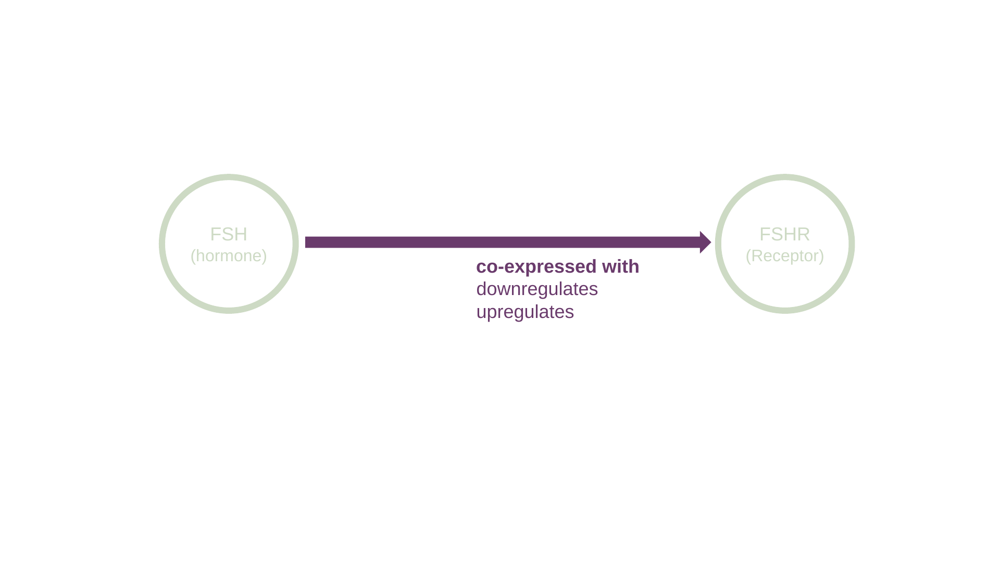

---

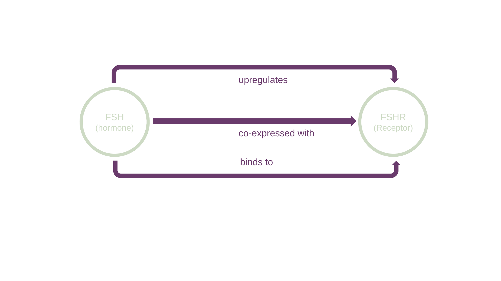

---

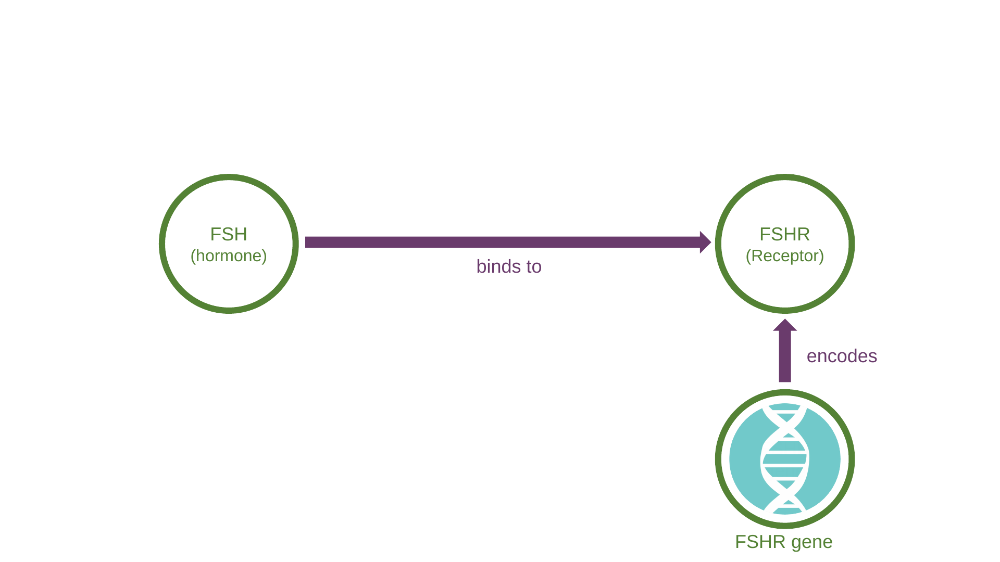

---

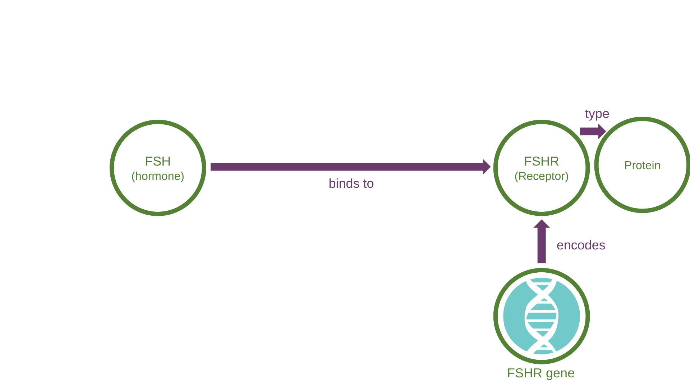

---

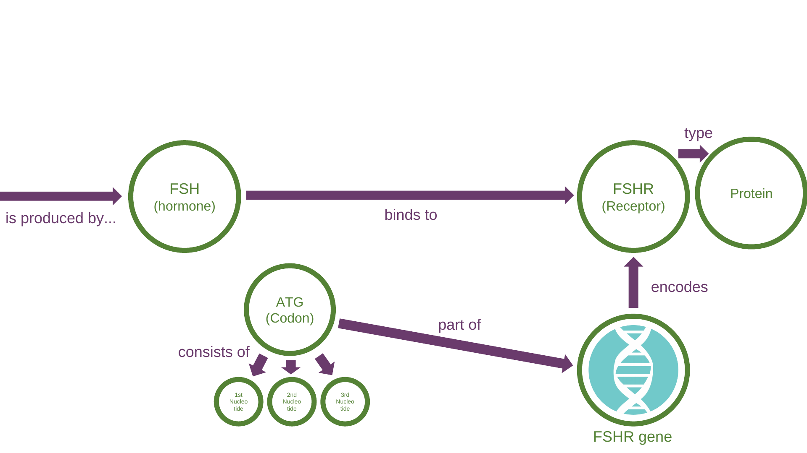

---

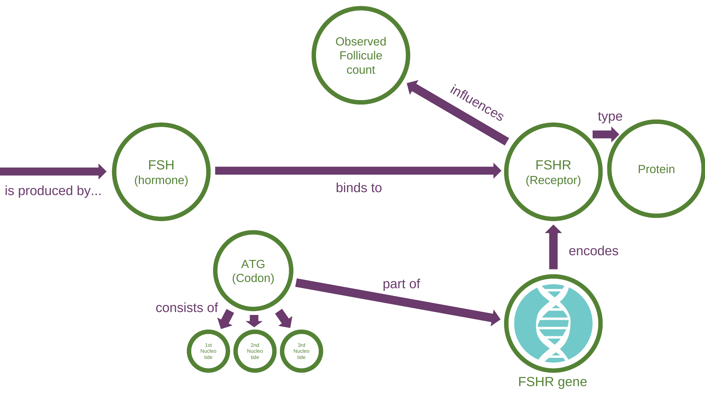

---


# How this helps us to research


* We can **query** this knowledge to go from a specific protein to the gene which encodes it, and generate a list of the candidate genes to investigate, which regulate that gene.
* ... using efficient, easy-to-state graph queries

---
# How this helps us to research

* An evolution from databases suitable to general computing, where we tend to use ever-more complicated NoSQL procedures/RDBMS databases, which entail thousands of lines of code, tens of queries.
  * Those become entangled, slow, and difficult to manage while keeping high software quality and

---
# How this helps us to research

* Broadly speaking, we can include the existing scientific body of relationships and ontologies in our graphs

* Large BioCypher projects often combine massive bodies of scientific knowledge

* E.g. existing gene information

---

# How we actually interact with a knowledge graph: **MATCH**

* We can "query out" from the root node along a path, looking at its relationships
* In Cypher, `MATCH` returns paths that satisfy the node and relationship pattern, e.g. `encodes` but not others e.g. `affects` **and the other node(s)**
* This naturally fits how we model causal relationships conceptually - as causal inference across a path of entities
* Or thinking of conditions as subclasses, like **Immune System Disease** being a `subclass of` **Disease**

<!-- first connection level in the path is "0", that's why you see [0..*] notation
any number of combinations is possible -->

---

<!-- _class: neo4j-graph -->
# With Neo4j for example, knowledge graphs are not just a concept or config file but visible:

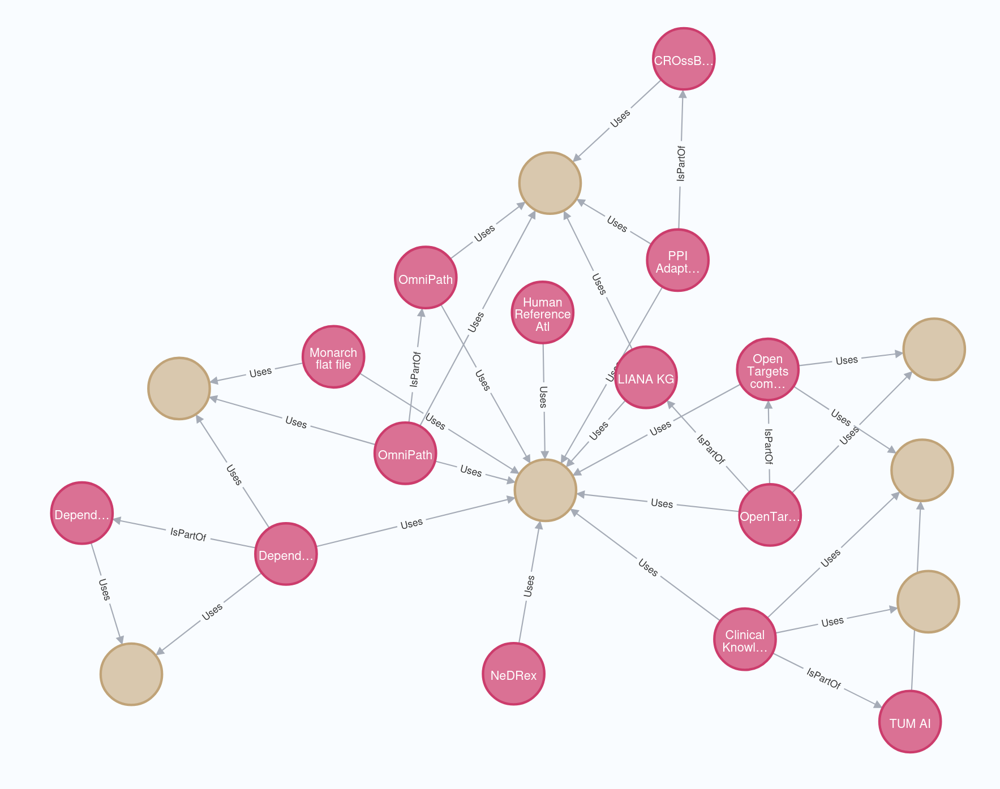

<!-- demo -->

---

# Recap

1. What is a node?
2. What is an edge?
3. What are the three parts of a triple?
4. How are graph queries different from RDBMS database queries?
5. Which Neo4j Cypher keyword matches graph patterns?

---

<ol>
  <li><strong>What is a node?</strong><br>Answer: Biological entity</li>
  <li data-marpit-fragment="1"><strong>What is an edge?</strong><br>Answer: Typed relationship</li>
  <li data-marpit-fragment="2"><strong>What are the three parts of a triple?</strong><br>Answer: Subject, predicate, object</li>
  <li data-marpit-fragment="3"><strong>How are graph queries different from RDBMS database queries?</strong><br>Answer: Easy and natural to state and read, avoid long procedures with multiple queries, can take advantage of subtypes in data edges and nodes</li>
  <li data-marpit-fragment="4"><strong>Which Neo4j Cypher keyword matches graph patterns?</strong><br>Answer: <code>MATCH</code></li>
</ol>

---

# Reasoning

* Inferring further information from the information at hand:
<!-- "Extrapolating" as a note -->

* Drug A `treats` Disease B
* Disease B is a `subclass of` Immune System Disease
* = Drug A `treats` **some** Immune System Disease(s)

<p class="cite-text" data-marpit-fragment="5">Different algorithm options exist to manage how reasoning inferences can be drawn</p>

---

# What is an ontology?

* An ontology is a controlled vocabulary for a domain,for example defining classes,`subclass of`, relationships,  aswell as data types, metrics, and units.
* In biology, this matters because the same thing can be named, grouped, or interpreted differently across datasets.
* In computational work, an ontology is a formal, explicit specification of a shared conceptualisation.

<p class="cite-text" data-marpit-fragment="5">Guarino, N., Oberle, D., & Staab, S. (2009). What is an ontology? In Handbook on ontologies (pp. 1–17). Springer.</p>

---

# Ontology example: precise medical terminology

* In medicine, precise terminology is not just style, it changes meaning.
* **“Seizure”, “convulsion”, and “abnormal motor movement”** can overlap in everyday speech, but they are not the same thing in structured clinical data.
* An ontology helps decide what concept is being described and how it relates to symptoms, diagnoses, observations, and patient features.
* Not actual data - the frame of possible data and relationships

<!-- akin to defining classes/interfaces in code -->

---

# Ontology standards: OWL

* OWL is a standard for formalizing ontologies.
* Classes, properties, axioms, and reasoning

---

<!-- what is reasoning ? -->

---


---
```
# Basic class("type") modelling
:Castle a owl:Class .
:Tower a owl:Class .

:hasPart a owl:ObjectProperty .

:castle1 a :Castle ;
    :hasPart :tower1 .

:tower1 a :Tower .

```
---


---

<!-- clearly a ruin -->

---

# OWL modelling:
tower `disjointWith` ruin

---


---


---
# OWL - Reasoning, rules
* disjointWith
* maxCardinality
* Provide confidence and certainty

---
# Ontology standards: RDFS
* RDFS adds schema vocabulary for classes and relationships such as `rdfs:subPropertyOf`.
* subPropertyOf hierarchy example: `regulates` → `regulates expression of` → `positively regulates expression of` → `positively regulates transcription of`.

<!-- computational approach, e.g. materialised triples, is separate -->


---
<!-- _class: ontology-match -->
# Quickfire

<div class="match-grid">
  <div>
    <p class="match-task">Which Ontology standard does each of these properties belong to?
    <small style="color:rgb(50,50,50)">And how have you used it?</small></p>
    <div class="term-tags">
      <span class="term-tag">subPropertyOf</span>
      <span class="term-tag">subClassOf</span>
      <span class="term-tag">disjointWith</span>
      <span class="term-tag">maxCardinality</span>
    </div>
  </div>
  <div class="standard-columns">
    <div class="standard-bin"><h2>RDF + RDFS</h2></div>
    <div class="standard-bin"><h2>OWL</h2></div>
  </div>
</div>

<!-- Answer: RDF + RDFS = rdfs:subPropertyOf, rdfs:subClassOf. OWL = owl:disjointWith, owl:equivalentClass. -->

---


<!-- <p class="cite-text" data-marpit-fragment="2">Daniel Himmelstein, Dec 19, 2016</p> -->


---


---


# Will converting my CSV into Knowledge Graph data with a clear Ontology be reasonably fast? How?

* Entity linking can automatically map text or labels to ontology/database IDs, e.g. “seizure” → HPO: Seizure; “EGFR” → UniProt/HGNC gene/protein ID.

* For tabular data, a tool called OntoWeaver can map tables into semantic knowledge graphs in BioCypher.

* For free text, it can be partially automated: scispaCy, MetaMap, CLAMP, MedCAT.

---

# Schemas
* We need to define the specific node and edge relationships in our data
* A schema file allows us to describe possible **triples** in a consistent way.
* Whereas an ontology can cover many relationships, the schema only covers relationships we have or expect data for in our study

---

# Schema files role in the project: Defining the information frame of your research question
* We often customize the schema to recognise the information architecture/value intrinsic to our data (which may differ from another information frame)
* ... to match our research question
* Data added according to one schema, should be internally consistent
* With BioCypher strict mode, we require provenance information, like source and license
* 🥐
<!-- in terms of batch effects, etc. -->

---

# BioCypher schema example

<pre><code class="language-yaml">gene:
  represented_as: node
  preferred_id: hgnc.symbol
  input_label: gene
  properties:
    name: str

...
</code></pre>

---

# BioCypher schema example

<pre><code class="language-yaml">gene:
  represented_as: node
  preferred_id: hgnc.symbol
  input_label: gene
  properties:
    name: str

transcription factor:
  is_a: gene
  represented_as: node
  preferred_id: hgnc.symbol
  input_label: transcription factor
  properties:
    name: str
    category: str

...
</code></pre>

---

# BioCypher schema example

<pre style="font-size: 0.82rem; line-height: 1.4; padding: 1rem; overflow-x: auto; white-space: pre; background: #f6f8fa; border: 1px solid #d0d7de; border-radius: 6px;"><code class="language-yaml" style="font-family: ui-monospace, SFMono-Regular, Menlo, Monaco, Consolas, monospace;">gene:
  represented_as: node
  preferred_id: hgnc.symbol
  input_label: gene
  properties:
    name: str

transcription factor:
  is_a: gene
  represented_as: node
  preferred_id: hgnc.symbol
  input_label: transcription factor
  properties:
    name: str
    category: str

transcriptional regulation:
  is_a: pairwise gene to gene interaction
  represented_as: edge
  source: transcription factor
  target: gene
  input_label: transcriptional regulation
  properties: ...
</code></pre>

---

# Not the role of Schema files: "Preprocessing" / Data ETL Pipelines
* The initial data gathering/processing is not what schema files describe
  * (Extract, Transform Load)
* The Schema describes a specific, confined, Knowledge Graph [with provenance], for the data in that project

---

# Challenges when building a Knowledge Graph schema

* Sometimes, the same biological “unit” can be described at slightly different, overlapping scales or frames

* Without schema discipline that BioCypher enforces, large graphs can become difficult to trust, query, and maintain - query results can be incomplete in practice

* This means documenting explicitly your choice of types, relationships, and building the frame your schema  has deliberately

---
# Schema framing example

---


<!-- this is not a pizza... or is it? Our research question frame matters. Do we define pizza as the ingredients, cooked? The appearance? The appearance in a location, or in the context of a given cuisine (e.g. Italian)? -->

---

# Why schema files are useful to you

* They make the graph structure understandable in a concise, standardised way.
* They clarify valid nodes and edges
<!-- flammkuchen, but not pizza, for example -->
* They prevent every adapter from inventing slightly different labels for the same things.
* They give you a guide to what you will use to query Neo4j later

<!-- they provide a concise definition of the biological concepts and links between them in the dataset. The graph structure is usually tailored to your research question too -->

---
<!-- _class: csv-exercise -->
# Schema and Properties Exercise: CSV to graph

<div class="exercise-grid">
  <div>
    <ol>
      <li>Pick the node columns.</li>
      <li>Name the edge.</li>
      <li>Mark provenance fields.</li>
      <li>Which row fails strict mode?</li>
    </ol>
  </div>
  <div>
    <p class="csv-label">example.csv</p>
    <table>
      <thead>
        <tr>
          <th>regulator</th>
          <th>target</th>
          <th>effect</th>
          <th>source</th>
          <th>license</th>
        </tr>
      </thead>
      <tbody>
        <tr>
          <td>MYC</td>
          <td>CDK4</td>
          <td>activation</td>
          <td>ExampleDB</td>
          <td>CC-BY</td>
        </tr>
        <tr>
          <td>STAT3</td>
          <td>SOCS3</td>
          <td>activation</td>
          <td></td>
          <td>CC-BY</td>
        </tr>
      </tbody>
    </table>
  </div>
</div>

<!-- Answer: nodes = regulator and target genes; edge = transcriptional regulation; provenance = source and license; failing row = STAT3 to SOCS3 because source is missing. -->

---

# Small Group Discussion: Your Schemas

---

# Ontology vs schema

* **Ontology:** agreed language for entities and interactions
* **Schema:** the project-specific guidebook for how this dataset becomes a graph
* When using external frameworks like Biolink, ontology gives the shared biological meaning.
* Reusing Biolink types makes your data consistent with Biolink* for queries that use extended data, as you implement your schema.

<p class="cite-text" data-marpit-fragment="5">Guarino, N., Oberle, D., & Staab, S. (2009). What is an ontology? In Handbook on ontologies (pp. 1–17). Springer.</p>

<p class="cite-text" data-marpit-fragment="5">* Catch: Batch effects</p>

---

# Side note: Label harmonization is not addressed by ontologies


* About data quality
* Part of "Harmonization", covered later
---

# Biolink


---
# Biolink as shared biomedical language
<ul>
<li data-marpit-fragment="2">Biolink provides a shared upper-level schema for biomedical entities and relationships.</li>
<li data-marpit-fragment="3">As a researcher you can extend these entities or relationships for your research question.</li>
<li data-marpit-fragment="4">That common grammar makes integration with other data sources easier, and makes running the same query on two different sets of data easier.</li>
</ul>

<p class="cite-text" data-marpit-fragment="5">Unni, D. R., Moxon, S. A., Bada, M., Brush, M., Bruskiewich, R., Caufield, J. H., et al. (2022). Biolink Model: A universal schema for knowledge graphs in clinical, biomedical, and translational science. Clinical and Translational Science, 15(8), 1848–1855.</p>

---

# How you actually use Biolink in BioCypher
* We set our "Head Ontology" in BioCypher to Biolink

* We map our data - imagine CSV columns - into Biolink types
* Then we add the edge relationships - defined by Biolink - we know exist across our entities.
* Our data is now fully parseable by a Biolink ontology-based query!

---

# Keeping projects clear and maintainable - why BioCypher helps you start off right

* Using Biolink as our Head Ontology, we can start our project **cleanly** with a **clear, yet extensible** set of valid nodes and edges

* Combined with `strict mode` - which requires license and source metadata - we can ensure all data that ever enters our graph has data provenance

* These two acts of discipline prevent maintenance work later and give you confidence in your project setup *without requiring major incremental effort*

* Projects with strict data provenance and clear ontologies to map to are **projects other scientists want to use**

---

1. What is an ontology?
2. What does reasoning add to a graph?
3. Ontology or schema: which is the project-specific guide for a dataset?
4. What does Biolink provide for biomedical entities and relationships?

---

<ol>
  <li><strong>What is an ontology?</strong><br>Answer: Broadly: Controlled vocabulary, allowed structure and reasoning rules</li>
  <li data-marpit-fragment="1"><strong>What does reasoning add to a graph?</strong><br>Answer: Inferred statements derived from the initial data</li>
  <li data-marpit-fragment="2"><strong>Ontology or schema: which do you build to express the data addressed by your research question?</strong><br>Answer: Schema</li>
  <li data-marpit-fragment="3"><strong>What does Biolink provide for biomedical entities and relationships?</strong><br>Answer: Shared upper-level schema across independent data and graphs</li>
</ol>

---

# Knowledge graphs in practise:

---

# We interact with knowledge graphs with:
* Queries
* Visual tools e.g. Neo4j
* Triplet inspection

<!-- e.g. for filtering data, for overview, for finding duplicates -->


---

# We can display that with other useful data context, e.g. spatially:

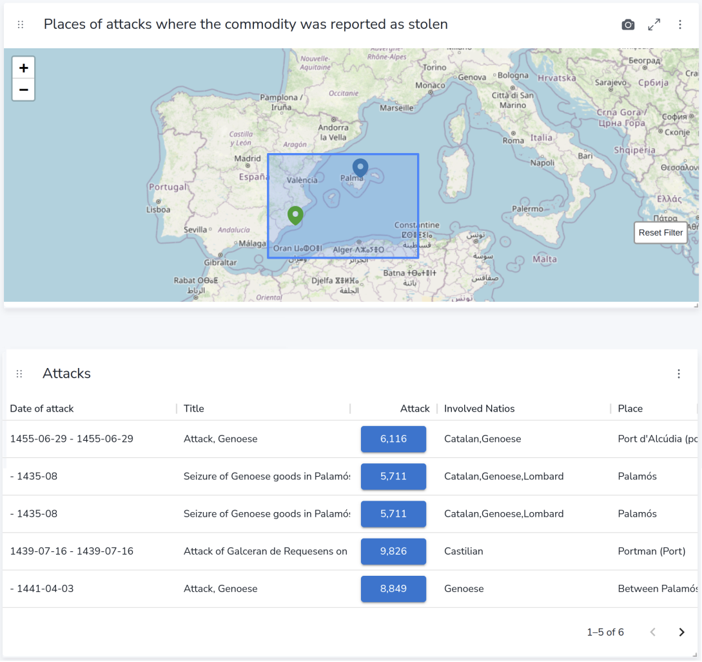

---


---


# We can write queries based on multiple relationships, inspired by our schema.

* Neo4j allows you to write queries, which can each `match` based upon multiple relationships and nodes.
* This asks which transcription factors activate which genes, and what references support the relationship.

<pre data-marpit-fragment="3"><code style="font-size:0.85em" class="language-cypher">MATCH (tf:`transcription factor`)-[r:`transcriptional regulation`]->(g:gene)
WHERE r.activation_or_inhibition = "activation"
RETURN tf.name, g.name, r.references
LIMIT 10
</code></pre>

<p class="cite-text" data-marpit-fragment="4">These feel logical and do not require long procedures to combine separate queries</p>

---

<!--  Asparagine → Glycine is the actual amino-acid substitution or not? -->
<!--
# We all use relationships to inform research inquiry - Medical study example

IVF is extremely difficult and can be unpredictable for women to undertake, as each treatment round is uncertain. Additionally, treatment response rates are not uniform for IVF.

* We understand some genetic elements behind IVF response.
* We understand a lesser proportion behind POI, Primary Ovarian Insufficiency.
* For IVF patients, we measure follicle response during treatment.
-->
<!--
# Medical study example part two

* FSH is follicle-stimulating hormone.
* FSH stimulates follicle development through FSHR.
* FSHR variation has been associated with different ovarian response to stimulation in IVF/ICSI patients.
* The specific FSHR variants often discussed are amino-acid-changing polymorphisms, including Thr307Ala and Asn680Ser.
* Those receptor and pathway differences may affect biological functions such as ovarian follicle development and treatment response.
* The point is the chain of events: hormone signal, receptor response, pathway activity, follicle response.

<p class="cite-text" data-marpit-fragment="5">Loutradis, D., Patsoula, E., Minas, V., Koussidis, G. A., Antsaklis, A., Michalas, S., & Makrigiannakis, A. (2006). FSH receptor gene polymorphisms have a role for different ovarian response to stimulation in patients entering IVF/ICSI-ET programs. Journal of Assisted Reproduction and Genetics, 23(4), 177–184.</p>
-->
<!--
# Theoretical study

**Theoretical study: Can we use known FSH and pathway relationships to explore overlap between POI biology and IVF follicle response?**

* This is a graph-based research question.
* It does not mean POI and IVF response are the same.
* It means we can query shared hormones, receptors, genes, pathways, and phenotypes.
* We can use the graph to find candidates for further investigation.
-->
<!--
# The power of that is querying across a massive range of interconnected entities:

* The fact that POI, Primary Ovarian Insufficiency, is conceptually linked to IVF enables us to explore this research direction, and in this case can be identified as a research question manually.
* But in some cases, we have many different partially related concepts: different amino acids, thousands of genes, and different ways of categorising disease.
* Knowledge graphs can help us identify and filter the *most promising candidates* at scales of relationship traversal we could never achieve ourselves by hand.
-->


# Fundamental Extensibility: Computational value of explicit assertions

* Explicit assertions can be queried in Neo4j.
* They can be filtered, validated against schema constraints, and embedded as features for statistical and machine learning models (e.g. historical cases).
* Formal schemas and constraints can be processed computationally, e.g. reasoning rules, as much as they help you understand the data well

---
# Fundamental trust, reliability and reuse:
* For data provenance, standardization and graph libraries support citing source information from the start, for example by using BioCypher strict mode
* In biology, your data's source and batch are critical for batch effects and comparability
* A relationship or entire dataset can have a source, method, dataset, paper, and confidence.


<p class="cite-text" data-marpit-fragment="5">McMillen, P., Novak, R., & Levin, M. (2020). Toward decoding bioelectric events in Xenopus embryogenesis: New methodology for tracking interplay between calcium and resting potentials in vivo. Journal of Molecular Biology, 432(2), 605–620.</p>


---

# The combination of those factors - computational explicitness, a concise schema definition, and reliability and reuse readiness - allows you to derive useful information soundly.

---
# Integrating data for new analysis

* 1. Imagine you have three different datasets from different experiments focusing on different genes.
* 2. You can use BioCypher to import data from each experiment and connect it to your knowledge graph, establishing how these genes are connected (or use an existing public dataset containing that information)
* 3. You can make new graph queries using the proteins connected across these three datasets to use in a fourth paper.

* If the same entity appears in multiple datasets, you can choose the strategy for connecting it to the graph.


---

# Key concepts in a nutshell

* A knowledge graph becomes useful because entities are not treated as isolated rows; they are connected through typed, interpretable relationships
* Queries can follow biologically meaningful paths across genes, proteins, pathways, phenotypes, treatments, and diseases - for example, causal paths
* BioCypher supports strategies for graph database choice, plus **ontology-choice freedom**, as well as **harmonization** and **information fusion** strategies with third-party software tools
* Use cases for actual research will be covered in later sessions

---


<!-- ML related, so removed:
# Example 1: Query the Knowledge Base for candidates to investigate:

* Which ion channels or gap-junction proteins are connected to certain phenotypes,
* are expressed in the relevant tissue,
* and are targetable by known compounds?

= a list of gap-junction proteins to investigate further for research applicability.

---

# Moving from sparse data to relevant evidence

* BioCypher can help structure heterogeneous biomedical data as a knowledge graph.
* This makes it easier to connect a rare subtype to related conditions, pathways, phenotypes, or historical evidence.
* This does not increase your experimental sample size by itself.
* External datasets are not automatically additional samples.
* Provenance, batch effects, population differences, and measurement differences still matter.
* These graph connections can support **cohort discovery**, **comparator group selection**, and **feature engineering**.
* Whereas LLMs are stochastic and unpredictable, graph queries are predictable and rules-based.

<p class="cite-text" data-marpit-fragment="5">Lobentanzer, S., Aloy, P., Baumbach, J., Bohar, B., Carey, V. J., Charoentong, P., et al. (2023). Democratizing knowledge representation with BioCypher. Nature Biotechnology, 41(8), 1056–1059.</p>

---

# Using graph-informed evidence for model training

* **For model training**, graph-derived relationships can be used as additional features.
* They should not be treated as extra experimental samples unless a separate statistical integration method justifies that.
* These features can represent genes, pathways, variants, diseases, or prior biological relationships.
* The model still needs empirical validation.

---

# Using graph-informed evidence for prediction

* **For prediction**, when a subtype has few direct cases, the graph can help identify related diagnoses, phenotypes, laboratory findings, or clinical relationships.
* Example feature: `count_of_related_negative_case_patterns`
* This is prior context for the model, not automatic extra sample size.

-->

---

# Using BioCypher means:

* you can access and extend existing knowledge graph datasets for biological research inquiry in your subdomain
* create easier-to-state queries by having a project-level schema to reference for constructing queries (e.g. in Neo4j)
* harmonize your own data with an extensible separation-of-concerns technical approach using third-party software for strategies, and define the graph in BioCypher in a consistent, interpretable, reusable format across projects
* share your data in a reusable way with the wider scientific community to achieve faster overall progress in biology

---

# BioCypher goal / purpose

* BioCypher does not try to make one universal biology graph;
* It helps you to create a graph for your research question, with access to biological data sources, with each project schema as its own frame
* It keeps source provenance while mapping data onto biomedical ontologies.

<p class="cite-text" data-marpit-fragment="5">Lobentanzer, S., Aloy, P., Baumbach, J., Bohar, B., Carey, V. J., Charoentong, P., et al. (2023). Democratizing knowledge representation with BioCypher. Nature Biotechnology, 41(8), 1056–1059.</p>

---

# BioCypher in Practice: Configure stringent rules for confident data querying, with project-specific schemas

* Rather than having questions later, such as “is seizure a Symptom, Clinical Finding, or PatientFeature in this context?”, you decide **when integrating data**.
* Being able to have an explicit record of what decision was made means you can make sure slight semantic differences **cannot prevent finding everything that actually satisfies the query** in your dataset.
* For example: recording seizure as a Clinical Finding, but only looking for “Symptoms” and not finding it.

---
# Data Harmonization
* Combining Heterogeneous data and decisions with conflicting or missing information
* We cover most harmonization levels for data (structural, label, semantic) on Wednesday

<!-- when integrating data = conceptually when defining the schema

Add strict mode? -->

<!-- also removed because we will wait until Edwin's Tuesday session to cover adapters
---

# Quick topic: Adapters

* Adapters provide an ontology-aligned way to bring existing biological resources into your graph.
* After using an adapter, Neo4j queries can use extra relationship data matched to entities in your dataset.
* Example: an adapter has information on which ion channels are expressed in different tissues, and which compounds can target them. Your data has some of the ion channels, so your queries can use that linked tissue and compound context.

---

# What the community adapters allow you to do:

* This allows you to ask richer biological questions immediately, without manually rebuilding all known relationships yourself.
* It provides a model of how relationships are often defined in this area of biology.
* It lets your dataset link to useful context from established biological resources, such as tissue expression, protein function, disease links, and compound targeting.

-->
---

1. What context frame should your schema address?
2. In a BioCypher schema, what does `represented_as: node` mean?
3. What does strict mode help preserve?
4. What can a Neo4j `MATCH` query follow?

---

<ol>
  <li><strong>What context frame should your schema address?</strong><br>Answer: Your focus/decision. E.g. Your research model, and often your specific research question</li>
  <li data-marpit-fragment="1"><strong>In a BioCypher schema, what does <code>represented_as: node</code> mean?</strong><br>Answer: Store as a node (which is clarified, because everything is a Triplet "under the hood")</li>
  <li data-marpit-fragment="2"><strong>What does strict mode help preserve?</strong><br>Answer: Data Source and license provenance</li>
  <li data-marpit-fragment="3"><strong>What can a Neo4j <code>MATCH</code> query follow?</strong><br>Answer: Node-edge patterns</li>
</ol>

---

# Summary: Key concepts and how BioCypher frames them

- Knowledge graphs help us make data with relationships navigable and queryable.
- Defining schemas for your ontology in BioCypher enables us to enforce data consistency and establish data provenance. Schemas give you powerful insight into what queries you can make.
- Existing ontologies and your datasets can be harmonized with provenance via strict mode from the start.

---

# Summary: What this does and how we will do it:
- This supports richer queries and candidate discovery, without maintaining complex, slow query procedures.
- Now that we understand the theory here, we will cover how these pieces actually interact, from using a CSV to using a public dataset.

<!-- maybe don't cover: batch effects and why extended datasets that analyzed the same data you have (e.g. but 10x more) cannot simply contribute to your data samples, even if you use exactly the same ontology (e.g. Biolink) -->
<!-- all icons from https://bioart.niaid.nih.gov/ BIOART -->


---

# Thank you for listening

---

# Image/Icon Credits

Icons: BioArt, https://bioart.niaid.nih.gov/, National Institute of Allergy & Infectious Diseases

Heidelberg Castle overview image: Eli Omen

Heidelberg Flag tower close up: Daniel Splisser

Heidelberg Tower Demolished:  Christopher Politano

Neo4j graphs and spatial examples: Images: Scientific Software Center, contents of graphs including meta graph: BioCypher team.


