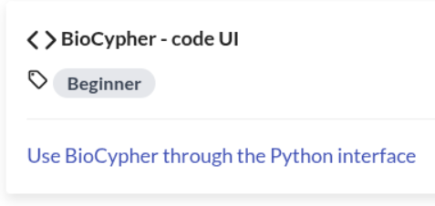
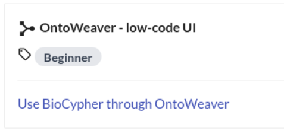
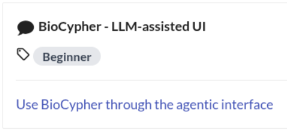

---

marp: true
style: |
section {
background-image: url('https://biocypher.org/BioCypher/assets/img/biocypher-open-graph.png');
background-repeat: no-repeat;
background-position: top 10px right 10px;
background-size: 70px auto;

---
# Three pathways to using BioCypher

https://ssciwr.github.io/biocypher/latest/learn/

Three options:

    Code - Low Code - AI-assisted

We will get started with these three options tomorrow.

---

# Preparations

Group A
- set up VSCode or your preferred IDE with a Python environment
- Install the necessary packages into the environment (BioCypher, OntoWeaver)
- Make sure neo4j is working

Group B
- discuss your projects goals and experiences with BioCypher
- show your Semantic Knowledge Graphs (SKGs)
- explain how you answer your scientific question: your use case
