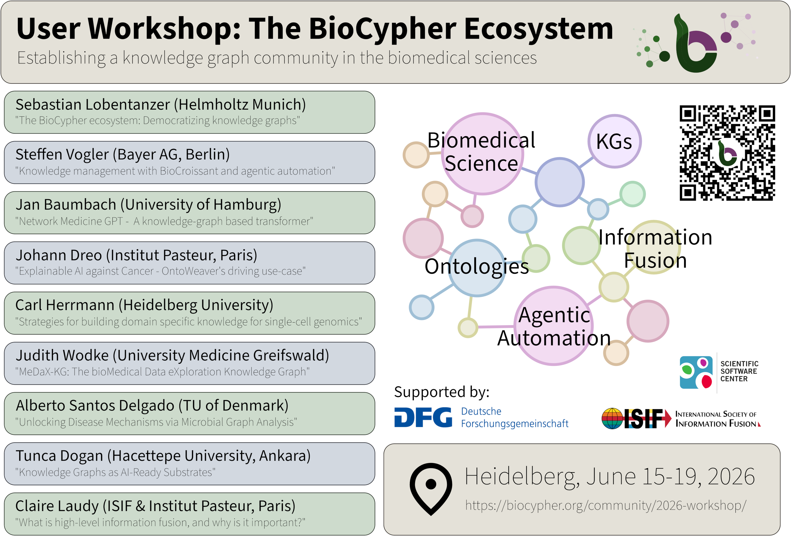

---

marp: true
style: |
section {
background-image: url('https://biocypher.org/BioCypher/assets/img/biocypher-open-graph.png');
background-repeat: no-repeat;
background-position: top 10px right 10px;
background-size: 70px auto;

---

# Workshop "Establishing a knowledge graph community in biomedical science"

---

# Workshop program

| | | Monday, 15th | Tuesday, 16th | Wednesday, 17th | Thursday, 18th | Friday, 19th |
|--|--|--|--|--|--|--|
registration | 8:45-9:15 | in front of the conference room | | | | | |
plenary talks | 09:15-10:45 | Sebastian Lobentanzer   Steffen Vogler	| Jan Baumbach (online)   Johann Dreo | Carl Herrmann	  Alberto Santos Delgado   Judith Wodke | Tunca Dogan   Claire Laudy | Highlights and contributing to BioCypher
coffee break | 10:45-11:00 | | | | | |
hands-on session A | 11:00-12:30 | Knowledge graphs and BioCypher | Hands-on OntoWeaver tutorial (Johann Dreo) | AI-supported open-source software development | OntoWeaver's fusion module (Johann Dreo) | Achievements, Feedback and end of workshop |
lunch break | 12:30-13:30 | | | | |Leaving premise for optional, cash requiring Cafe Botanik lunch (10 minutes away)|
hands-on session B | 13:30-15:00 | Knowledge graphs and BioCypher | Adapters in BioCypher | Harmonizing biomedical data | Building Adapters in BioCypher | |
coffee break | 15:00-15:15 | | | | | |
hands-on session C | 15:15-16:45 | Knowledge graphs and BioCypher | BioCypher MCP | Harmonizing biomedical data | BioChatter, Biotope and more | |

---

# Workshop organizers

* Workshop organizers and volunteers wear red lanyards instead of black
* Feel free to approach us with questions!

**A huge thanks to the local organizers Edwin Carreño, James Bowyer, Yasamin Fazeli (all SSC) and to our volunteers Amey Narwadkar and Anand Deshpande!**

**Also thanks to our additional organizers Sebastian Lobentanzer, Claire Laudy and Johann Dreo!**

---

# Plenary talks Monday

Sebastian Lobentanzer, Helmholtz Munich:

***The BioCypher ecosystem: Democratizing knowledge graphs***

Steffen Vogler, Bayer AG Berlin:

***Knowledge management with BioCroissant and agentic automation***

