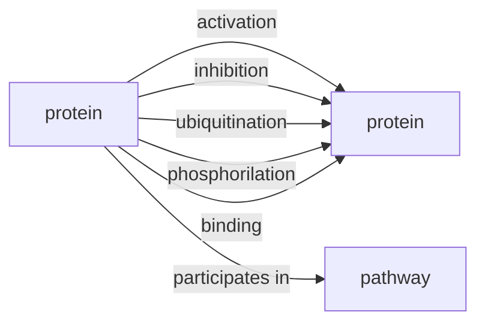
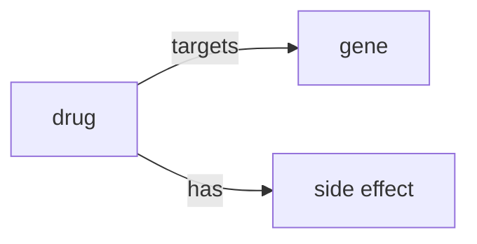

# Datasets

## Novice Track

- Synthetic Protein Protein Interactions dataset
    - TSV file
    - Croissant Examples
    - [source](https://zenodo.org/records/20733159)

- Synthetic Pathways dataset
    - TSV file
    - [source](https://zenodo.org/records/20742395)
---

## Advance track

- Drug Central: useful for drug targets gene subgraph!
    - [Source](https://drugcentral.org/download)

- SIDER: useful for drug has side effect subgraph!
    - [Source](http://sideeffects.embl.de/download/) 
