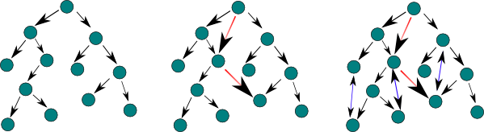
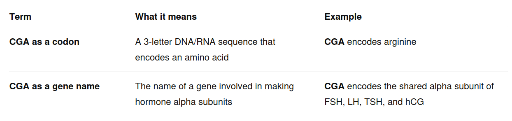
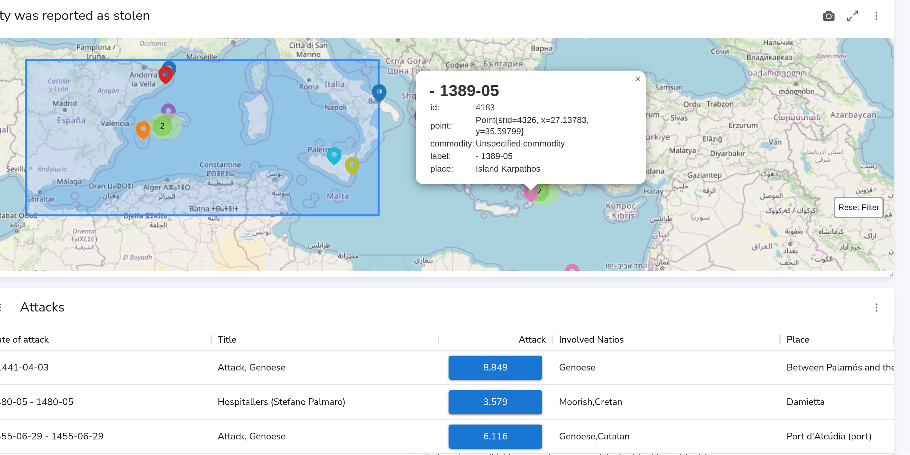

---

marp: true
style: |
section {
background-image: url('https://biocypher.org/BioCypher/assets/img/biocypher-open-graph.png');
background-repeat: no-repeat;
background-position: top 10px right 10px;
background-size: 70px auto;
}
-

---

# Knowledge Graphs & Ontologies in Biology

---

# Why we use Knowledge graphs

- Biology is extremely relational: encoding, interaction, affecting, targeting
- Understanding the full toolchain and how it works with the pure complexity and amount of different entities, such as proteins, genes, and codons, is difficult without automation.
- We can represent a relationship with the concept of graphs that connect our entities by their relationships. In these graphs, our entities are traditionally "Nodes".

---

# Nodes vs Edges

* Nodes are the biological entities in the graph, such as proteins, genes, transcription factors, pathways, diseases, or compounds.
* Edges are the typed relationships between nodes, such as `interacts_with`, `regulates`, `expressed_in`, `targets`, or `associated_with`. **You can define this for your own dataset with BioCypher!**

---
# Nodes vs Edges - COLLECTRI Example
* In a regulatory interaction dataset such as COLLECTRI, transcription factors and genes can be represented as nodes, while experimentally supported regulatory relationships can be represented as edges.
* Example: one transcription factor node may activate or inhibit a target gene node.
* Both kinds of data are important: nodes tell us *what* exists, and edges tell us *how entities relate biologically*.

---
# What is an ontology?

* An ontology is a controlled vocabulary for a domain.
* It defines what kinds of things exist, what they mean, and how they can relate to each other.
* In biology, this matters because the same thing can be named, grouped, or interpreted differently across datasets.

---

# Ontology example: precise medical terminology

* In medicine, precise terminology is not just style, it changes meaning.
* “Seizure”, “epilepsy”, “convulsion”, and “abnormal motor movement” can overlap in everyday speech, but they are not the same thing in structured clinical data.
* An ontology helps decide what concept is being described and how it relates to symptoms, diagnoses, observations, and patient features.

---
# Ontology example: sautéing broccoli

* Even discussing how you cook something needs an ontology.
* In a pan, broccoli can be steaming, sautéing, charring, softening, staying crisp-tender, or becoming mushy.
* "Sautéing broccoli" is not only “heating broccoli” - it implies cooking quickly with a small amount of fat, managing moisture, encouraging some browning, preserving texture, and producing a different result from boiling or steaming.
* Without shared terms, two people can describe the same pan or process, very differently

---

# Ontology vs schema

* **Ontology:** the general biological language.
* **Schema:** the project-specific rulebook for how this dataset becomes a graph.

---

# Why schema files exist

* They make the graph predictable.
* They say which labels are valid nodes and edges.
* They prevent every adapter from inventing slightly different labels for the same things.
* They give you a guide as to what you will use to query Neo4j with later.
* You start with the schema.

---

# BioCypher schema example

<pre><code class="language-yaml">gene:
  represented_as: node
  preferred_id: hgnc.symbol
  input_label: gene
  properties:
    name: str

...
</code></pre>

---

# BioCypher schema example

<pre><code class="language-yaml">gene:
  represented_as: node
  preferred_id: hgnc.symbol
  input_label: gene
  properties:
    name: str

transcription factor:
  is_a: gene
  represented_as: node
  preferred_id: hgnc.symbol
  input_label: transcription factor
  properties:
    name: str
    category: str

...
</code></pre>

---

# BioCypher schema example
<pre style="font-size: 0.82rem; line-height: 1.4; padding: 1rem; overflow-x: auto; white-space: pre; background: #f6f8fa; border: 1px solid #d0d7de; border-radius: 6px;"><code class="language-yaml" style="font-family: ui-monospace, SFMono-Regular, Menlo, Monaco, Consolas, monospace;">gene:
  represented_as: node
  preferred_id: hgnc.symbol
  input_label: gene
  properties:
    name: str

transcription factor:
  is_a: gene
  represented_as: node
  preferred_id: hgnc.symbol
  input_label: transcription factor
  properties:
    name: str
    category: str

transcriptional regulation:
  is_a: pairwise gene to gene interaction
  represented_as: edge
  source: transcription factor
  target: gene
  input_label: transcriptional regulation
  properties: ...
</code></pre>

---

# BioCypher schema example

<pre><code class="language-yaml">transcriptional regulation:
  is_a: pairwise gene to gene interaction
  represented_as: edge
  source: transcription factor
  target: gene
  input_label: transcriptional regulation
  properties:
    activation_or_inhibition: str
    resources: str
    references: str
    sign_decision: str
</code></pre>

---

# Knowledge graph: With Neo4J

* Neo4j allows you to write queries, which can each match based upon multiple relationships and nodes

* This asks which transcription factors activate which genes, and what references support the relationship.
<pre><code style="font-size:0.85em" class="language-cypher">MATCH (tf:`transcription factor`)-[r:`transcriptional regulation`]->(g:gene)
WHERE r.activation_or_inhibition = "activation"
RETURN tf.name, g.name, r.references
LIMIT 10
</code></pre>

* These feel human-writtn and AI can support writing these too when you provide the relevant relationships to query.

---

# Ontologies

* Help us agree upon the way to describe our domain
* Have specific ways of characterizing relationships(*edges*) in their biological context within a dataset consistently
* Relationships can be defined according to the semantics of the research field and the theories at hand
* Represent the wider fidelity of data, rather than data without clarified, identified relationships

---

# Encoding relationships

* Relationships in biology help understand the causes of events that we measure in data.
* For much data, like genes or cells, we have a rich ontology of everything that relates to them, such as what the cell is made of, what receptors it has, and what encodes its behaviour, which is relevant for research.
* For those existing, well defined areas, you can fuse information with large third party datasets to use with your own queries for Knowledge Graph information.

---

# We all use relationships to inform research inquiry - Medical study example

IVF is extremely difficult and can be unpredictable for women to undertake, as each treatment round is uncertain. Additionally, treatment response rates are not uniform for IVF.

* We understand some existing gene variants behind POI, Primary Ovarian Insufficiency, previously often called POF, Premature Ovarian Failure, which can reduce or prevent normal egg cell development and ovulation.
* Can we find commonalities between the genetic variants associated with POI and genetic variants found in IVF patients?

---

# Medical study example part two

* We already know certain proteins and hormones, e.g. FSH, affect the biological function of reproduction, such as follicle development and ovarian function.
* A single nucleotide variant may change a DNA sequence from CGA to GGA.
* If this change occurs in a protein-coding region, it may change the amino acid sequence of a protein. Those proteins, or the hormones they help form, can affect biological functions such as ovarian follicle development and response, not just in POI, but theoretically also in IVF
* There could be a correlation between carrying that variant and IVF success rates.

The point is the chain of events: a single nucleotide change can alter a codon, which can alter an amino acid, which can alter a protein or hormone-related pathway, which may influence reproductive function and IVF outcomes.

---

# The power of that is:

* The fact that POI, Premature Ovarian Insufficiency, is conceptually linked to IVF enables us to explore this research direction, and in this case can be identified as a research question manually.
* But in some cases, we have many different partially related concepts: different amino acids, thousands of genes, and different ways of categorizing disease.
* Knowledge graphs can help us identify and filter the *most promising candidates* at scales of relationship traversal we could never achieve ourselves by hand.

---

# Why Knowledge Graphs are useful to you

* If you believe the processes, pathways, and subtypes in your data provide context to research, you can combine your data with other datasets with prescribed ontologies. That makes it easier to manage data provenance, e.g. duplication, and extract useful research candidates and substrates.
* You can trust third party existing knowledge graphs based on rigid schema ontologies to manage data provenance well and provide a rich extension to your data points with pathways 
* Knowledge graphs work with relationships in any direction.

---

# The power of ontology:

* Having relationships defiend in an ontology schema means confusion over similar entities, entities that are part of each other, dissimilar but similarly named entities, a recurrent risk in biology, or the same entity with different names, such as "human" vs "Homo sapiens", can be approached systemically for better **data provenance**.
* You can trust your data itself better when you have approached how relationships are defined for the whole dataset together, rather than manually adding nodes or graph relationships - which works at first but can result in large disreprencies or data provenance issues down the line 

---

# Knowledge graphs are statements of fact, not probability:

* This expresses or leads to that.
* This can express or can lead to that.
* The relationship itself is the data: source node, relationship type, target node.
* Uncertainty can still be represented, but it should be modeled explicitly as evidence, confidence, or provenance.

---

# Knowledge graphs

* A knowledge graph becomes useful because entities are not treated as isolated rows; they are connected through typed, interpretable relationships.
* Queries can follow biologically meaningful paths across genes, proteins, pathways, phenotypes, treatments, and diseases.
* Knowledge graphs are especially useful when data for a specific subtype is sparse, because they can help identify biologically or clinically related conditions, phenotypes, mechanisms, or patient cohorts.
* This allows researchers to use structured prior knowledge to generate hypotheses, retrieve relevant comparator groups, and enrich downstream analysis.

---

# Moving from sparse data to relevant evidence

* BioCypher can help structure heterogeneous biomedical data as a knowledge graph, making it easier to connect a rare subtype to related conditions through historical cases.
* These graph connections can support **cohort discovery**, **comparator group selection**, and **feature engineering**.
* The key idea is not simply "adding more data," but finding **more relevant evidence** through biologically and clinically meaningful relationships defined by ontologies avbout existing subtypes and conditions.
* Whereas LLMS are stochastic and unpredictable, using Graph Queries is predictable and rules based

---

# Using graph-informed evidence in models

* **For model training**, graph-derived relationships can support cohort expansion, feature engineering, or transfer-learning-style approaches, provided the related conditions are biologically and clinically comparable.
* If the subtype is genuinely related to a better-characterized condition, incorporating graph-informed features or comparator cohorts may improve recall, precision, or F1 score. This should be validated empirically.

* **For prediction**, when a subtype has few direct cases, the graph can help identify historical patients with similar diagnoses, phenotypes, laboratory findings, or clinical relationships.
* Example feature: `proportion_of_similar_historical_negative_cases_above_0.85`
* This could mean: the proportion of historical negative cases that share at least 85% of predefined clinical relationships with the current patient.

---

# Knowledge graphs can have spatial data: Mediterranean map

---

# Knowledge Graphs can still be exposed in spatial interfaces:

---

# Difference from spatial data:

Clustering algorithms can cluster different cell types under analysis and link them to different genes.

That is useful too, and it is different. Clustering based on expression does appear on a 2D graph, but the actual entities, for example two points near each other, are not actually necessarily related. Even if the distance between cells tells us something about how they are related or their group, this is not a knowledge graph, especially when the relationship has not been described with an edge type. "part of" or "has a" are extremely different and not possible to encode with spatial data.

---

# Challenges with knowledge graphs

Different ways of describing the same ontologies, or different levels of data granularity for knowledge graph content.

Sometimes, the same biological "unit" can be described at slightly different, overlapping scales.

Different datasets doing this makes managing and drawing insights across omics difficult.

* Without schema discipline that BioCypher enforces, large graphs can become difficult to trust, query, and maintain.

---

The goal of BioCypher is to resolve the difficulty of:

(A) understanding the applicability of knowledge graphs for biological research inquiry in your subdomain
(B) enabling rapid research with knowledge graphs
(C) supporting the provision of your own data to this analysis
(D) sharing your data with the wider scientific community to achieve faster overall progress in biology

---

# BioCypher configures stringent regulation

* Rather than having questions later, such as "is seizure a Symptom, Clinical Finding, or PatientFeature in this context?", you decide when integrating data.
* And when you have 10 curious questions one morning, you want predictability in what you should ask.
* Are disease IDs coded IDs or free text? This may not matter, but all must be consistent. This helps data provenance.

---

# Example 1: Query the Knowledge Base for candidates to investigate:

* Which ion channels or gap-junction proteins are connected to certain phenotypes,
* are expressed in the relevant tissue,
* and are targetable by known compounds?

= a list of gap-junction proteins to investigate further for research applicability.

---

# Example 2: BioCypher for historic, as-yet unconnected, integratable work in reanalysis papers

* 1. Say you have 3 different datasets from different experiments focusing on different genes.
* 2. You can use an adapter to bring the information in, and then use ontology data from, e.g. UniProt, to understand what genetics, proteins, and pathways occur in common between those different separate datasets.
* 3. You can make conclusions with the proteins between these 3 datasets in a 4th paper.

---

# But, my data would take a long time to convert into ontology concepts...

It can take time, but we do not need to do everything manually.

* Entity linking maps text or labels to ontology/database IDs.
  e.g. “seizure” → HPO: Seizure; “EGFR” → UniProt/HGNC gene/protein ID

---

# Further ways to make your data work with ontologies:

* Annotation can add structured meaning to raw data.
  Convert text into a graph node, edge, or property. For free text, it can be partially automated: scispaCy, MetaMap, CLAMP, MedCAT. You can also cluster text embeddings or use prompt-based local text classification.

* Tabular-to-graph tools can help.
  OntoWeaver can map tables into semantic knowledge graphs and can be used with BioCypher-style graph construction.

* The goal is not perfect automation.
  The goal is a reproducible mapping pipeline where uncertain mappings, thresholds, and assumptions are visible.

---

# Why Adapters exist

* Adapters provide an ontology and dataset that can augment your data.
* After using an adapter with your data, your queries, e.g. via Neo4j, can use the extra relationship data matched to entities in your dataset from the adapter’s extended datasets.
* Example: Adapter has a dataset on which ion channels are expressed in different tissues, and which compounds can target them.
* This allows you to ask richer biological questions immediately, without manually rebuilding all known relationships yourself.
* It lets your dataset inherit useful context from established biological resources, such as tissue expression, protein function, disease links, and compound targeting.

<!-- could add: "How to go from dataset CSVs to schemas" -->
